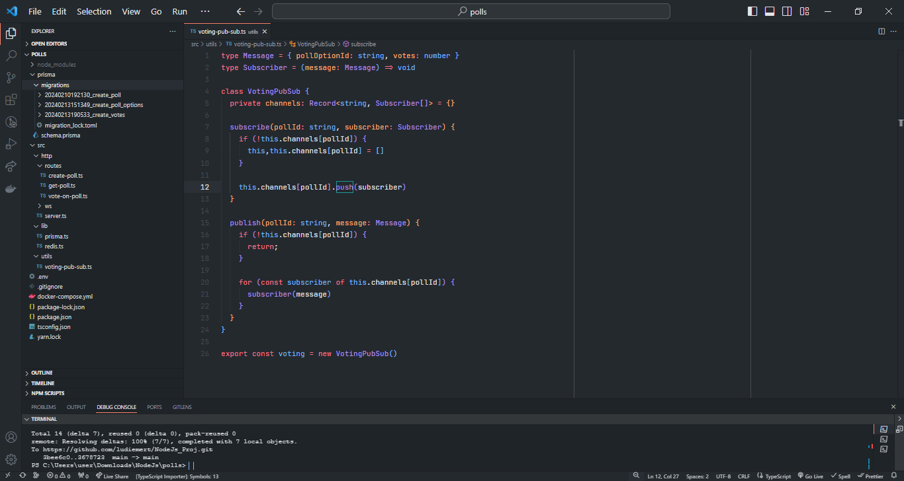
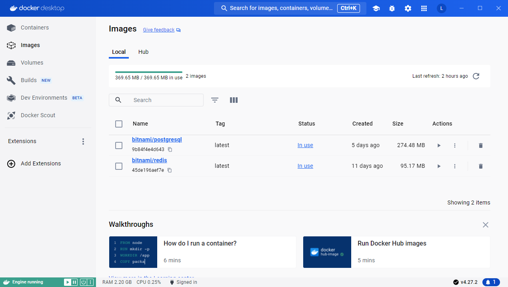
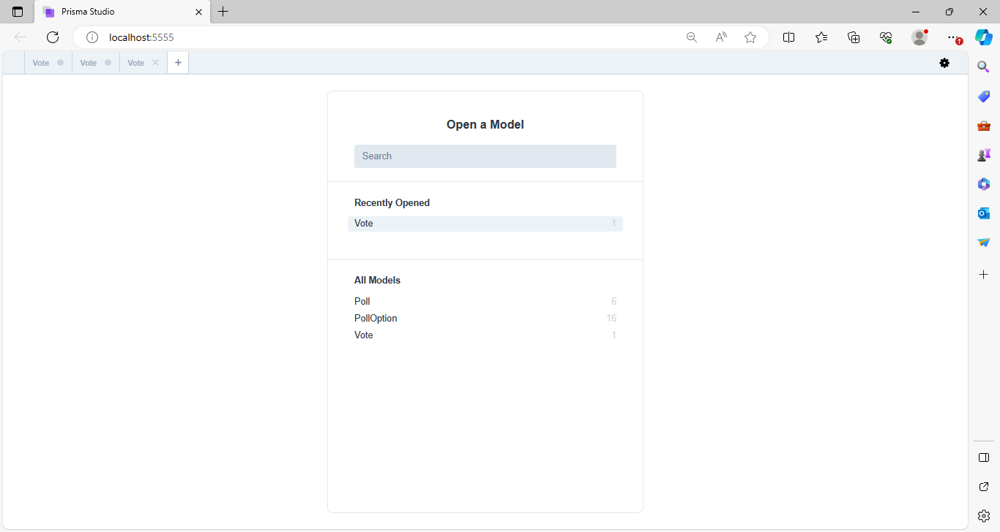
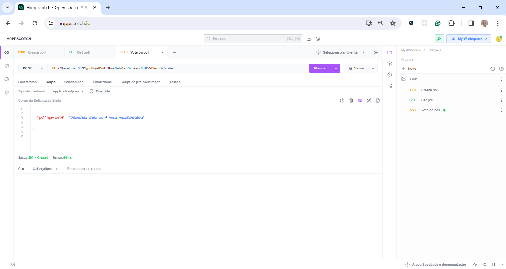
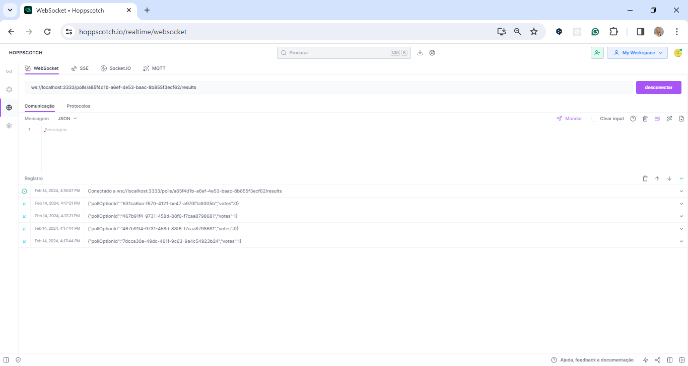

Modelo README PROJETOS GITHUB
<h1 align="center"> 💻 NLW Expert - Node.js</h1>

<br>
<p align="center">


<br>


</p>

### About

This project was proposed by Rocketseat in <strong>Next Level Week Expert - Node.js track</strong>. 
The challenge involves the development of the backend for a polling application with data stored using PostgreSQL and Prisma ORM,
vote count stored with Redis for quick retrieval, and real-time feedback to connected clients through websockets.

A real-time voting system where users can create a poll and other users can cast their votes. 
The system generates a ranking among the options and updates the votes in real-time.

## How to Run

You will need Node.js and Docker installed on your machine.

```bash
# create .env file based on .env.example
cp .env.example .env
```

```bash
npm i
docker compose up -d
npx prisma migrate dev
npm run dev
```

## How to test

Use any tool to test APIs, like Postman, Insomnia or Hoppscotch.

Test the endpoints as per the examples below, where `server_base_url` is the same as `localhost:3333`.

<h2 align="center"> 💻 Project Vscode</h2>
<div align="center">
 
</div>
---

<h2 align="center"> 💻 Project Docker</h2>
<div align="center">
 
</div>
---

<h2 align="center"> 💻 Project BD_Prisma_Studio</h2>
<div align="center">
 
</div>


### Create a Poll

`/polls`: Pass data with `title` and `options` in the body:


### Get Poll Data

`/polls/:pollId`: Pass pollId as queryParam


### Vote on Poll

`/polls/:pollId/votes`: Vote on a poll using pollId as queryParam and `pollOptionId` in the body

<h2 align="center"> 💻 Project hoppscotch_Back</h2>
<div align="center">
 
</div>


### Realtime Feedback

`/polls/:pollId/results`: Connect to a poll WebSocket Channel with its Id

<h2 align="center"> 💻 Project hoppscotch_Back_Conection</h2>
<div align="center">
 
</div>


## Useful Commands:

### Docker

```bash
# Run docker in detached mode
docker compose up -d

# list containers
docker ps

# Show logs of a container execution
docker logs <container_id>

# stop execution of a container
docker kill <container_id>
```

<h2 align="center"> 💻 Project Docker</h2>
<div align="center">
 
</div>

### Prisma

```bash
# starts a project with prisma
npx prisma init

# applies database migrations in the development environment
npx prisma migrate dev

# opens a GUI to explore and manage your database data
npx prisma studio
```

<h2 align="center"> 💻 Project BD_Prisma_Studio</h2>
<div align="center">
 
</div>

---

#### 🛠 Tecnologias | Tecnologias
#### The following tools were used in building the project


- [Axios](https://axios-http.com/)
- [ReactJS]( https://pt-br.legacy.reactjs.org/)
- [Node](https://nodejs.org/)
- [MYSQL_Workbench]( https://www.mysql.com/products/workbench/)


#### 📝 Licença

Esse projeto está sob a licença MIT. Veja o arquivo [LICENSE](LICENSE) para mais detalhes.

---

#### ✒️ Authors

 *  * **Rocketseat**

- #### My LinkedIn - [](https://www.linkedin.com/in/lucianadiemert/)

#### Contact


#### [**Luciana Diemert**](https://github.com/ludiemert)

🛠 `Front-end` `Back-end`Developer Jr. <br>
📍 São Jose dos Campos – SP - Brazil

<a href="https://www.linkedin.com/in/lucianadiemert" target="_blank"></a>&nbsp;
<a href="mailto:lucianadiemert@gmail.com" target="_blank"></a>&nbsp;
<a href="#"></a>&nbsp;
<a href="https://www.github.com/ludiemert" target="_blank"></a>&nbsp;

<br clear="left"/>

------------------
## 🎁 Acknowledgements and dedications

* Thank you #Rocketseat team

